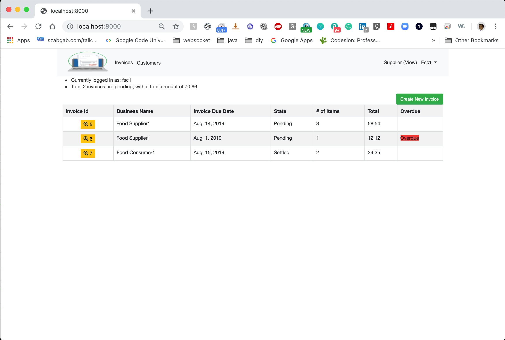
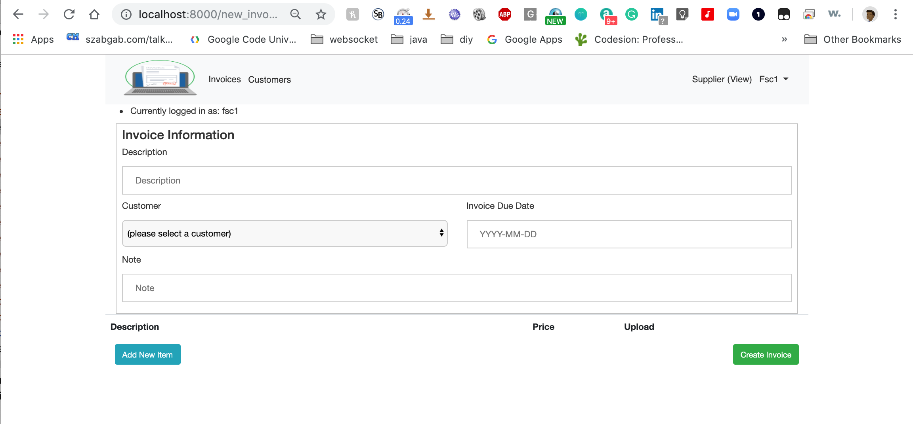
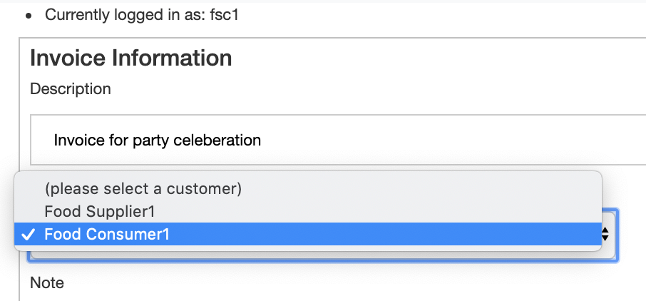
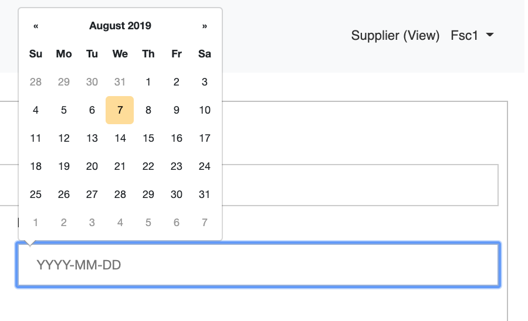
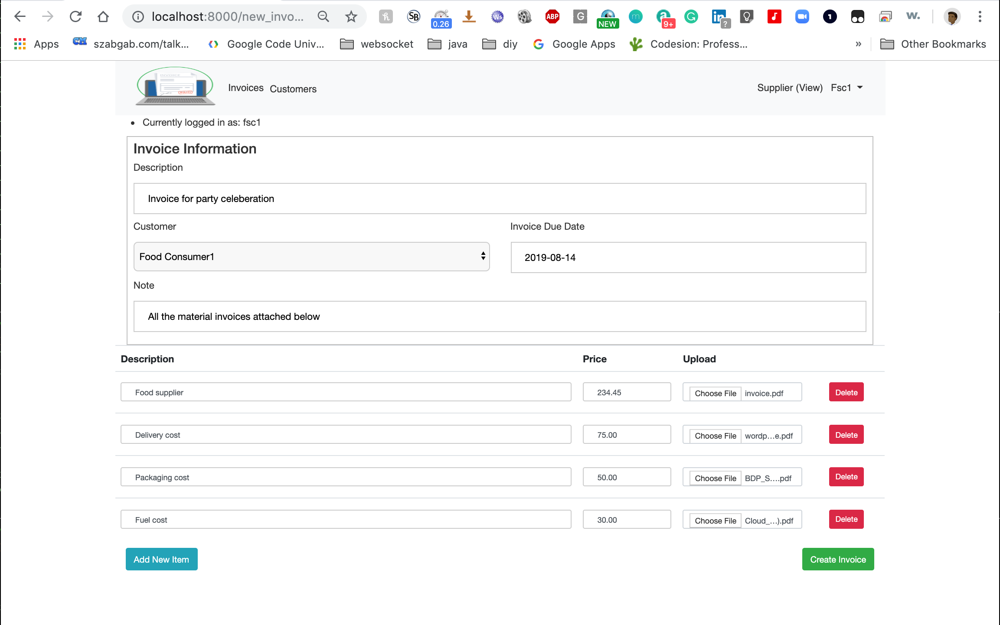
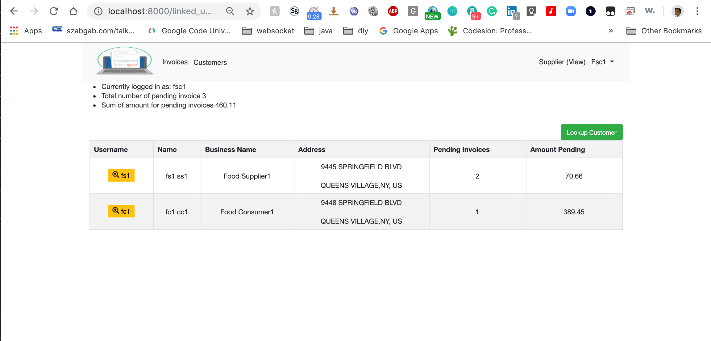
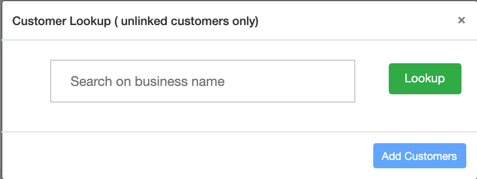
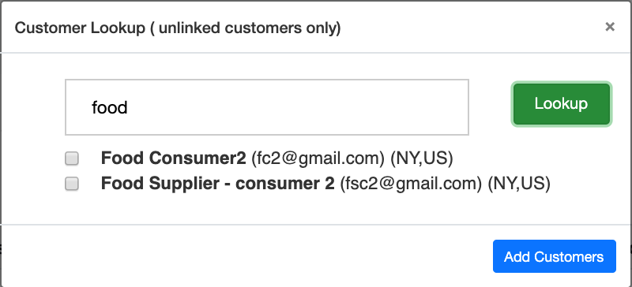
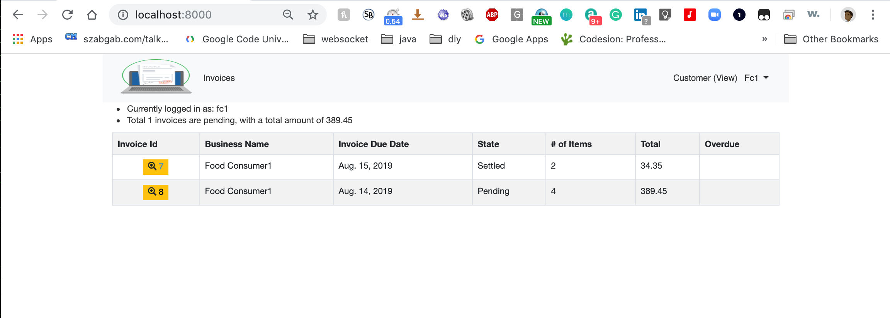
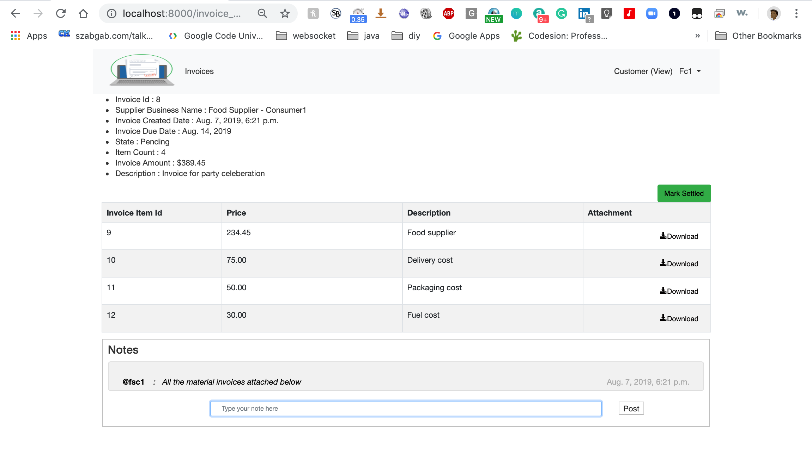

# CIMS - Centralized Invoice management system

This is a Django python app, with a goal to provide a unified view to enable suppliers to create invoices and upload files for their customers.
Customers would be able to view/download invoices from different suppliers. For the invoices customers will be able to update status like marking them as settled. 
Supplier and Customers would be able to exchange notes on the invoices that would show up in the invoice detail page.

## Challenging problems addressed

1) Added support for media(pdf file) upload/download support by using FileField support in Django.
2) Support for building on top of Django default entity user, where in a commit to user object is made.

## Models
1) Address:- Model to store the address for supplier/customer in the system
2) ExtendedUser:- Storing additional attributes for the user object
3) SupplierCustomerRelation:- Model to represent linked suppliers customers in the system
4) InvoiceState:- Model for storing Invoice state
5) Invoice:- Model for storing Invoice details
6) InvoiceNote:- Model for storing different notes on the invoice
7) InvoiceLineItem:- Model for storing invoice line items that were a part of the invoice
8) InvoiceLineItemNote:- Model for storing different notes on the invoice item level

## UI pages
1) base.html :- Base template for all of the html pages
2) create_invoice.html:- UI page to create a new invoice in the system
3) invoice-details.html:-HTML page for showing invoice details for a specific invoice, depending on supplier/customer view it modifies the
Business Name it also has different actions based on the current logged in view
4) invoices.html:- HTML page for showing all the invoices, if the user has logged in as a supplier than it shows all the invoices that this supplier has created.
If the user logs in as customer, then this page shows all the invoices created by different suppliers for this user
5) login.html:- HTML page for a user to login into the system
6) register.html:- Screen for registration of a new user
7) users.html:- UI page to show all the linked customers for a supplier 

## Credential for testing

1) For supplier account please use 
   - username:- fsc1 
   - password:- test 
   - Supplier account radio button
    
2) For customer account please use
   - username:- fc1
   -  password:- test 
   - Customer account radion button
       
## Flows

1) When a user opens the url http://localhost:<port> for the first time or when no active session exists the following login screen is shown.
    

2) First time users can create there account by registering an account. Following is the registration page. On the registration page, he can choose whether he wants to register as a supplier or a customer.
    

3) User can login as by selecting the supplier in the login screen mentioned above

4) Post logging in as supplier the supplier home screen looks like following.

    

5) Post logging in as supplier the supplier home screen looks like following.

    

6) Supplier can click on Create New Invoice button to create a new invoice in the system.

    

7) During the invoice creation the supplier can select from a dropdown of already linked customers
    

8) Supplier can select the date the invoice is due along with other invoice details. A supplier can click on Add new item button to add more items associated with the invoice. He can also upload the invocice file.
    

9) Invoice creation screen with several invoice sub items looks like following.

    

10) Supplier can also look at his customers and select on a customer to view all the invoices created for that customer.

    

11) Suppliers can look up customers already in the site by selecting Lookup customer.

    

12) The looked up customers can be linked to the supplier account.
    

13) When a Customer logs in into the system by selecting the customer radion button in the login screen, he sees a list of invoices created for him.

    

14) Customer can view the details of the invoice, send a note to the supplier and mark the invoice as settled.
    

