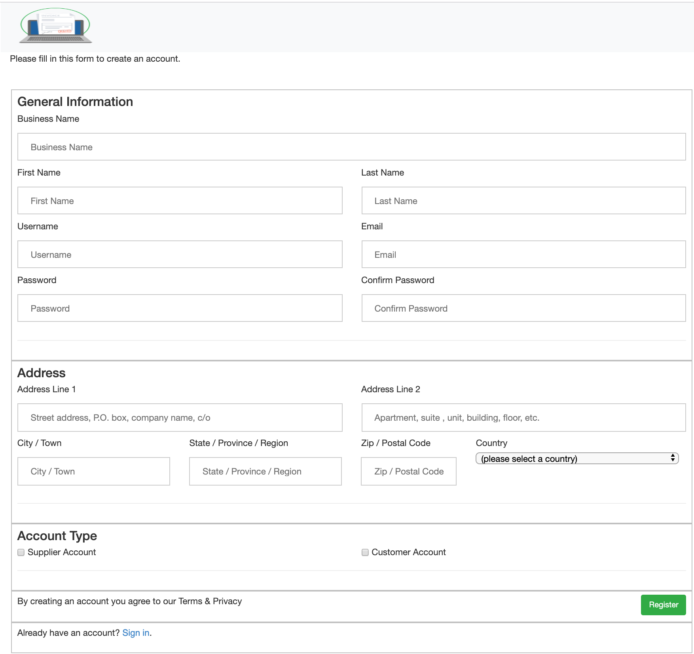

# Project 3

Food Ordering Website for PinocchiosPizza.com

## Models

For the implementation the solution relies on 10 tables

1) Category: Model for Category object.
2) Item: Model for Item object.
3) ServingSize: Model for size of the item. Every item needs to have atleast one Size out of regular, small and large.
4) AddOn: Model for representing the toppings.
5) CategoryAddOnPrice: Model for representing category to addon prices. E,g for Pizzas
6) ItemSizePrice: Model for representing items and size combination.
7) ItemAddOnPrice: Model for representing category to item prices. E,g for Steak + Cheese subs where toppings are paid
8) OrderState: Model for storing Order state
9) CustomerOrder: Model for storing all the orders in the system
10) CustomerOrderLineItem: Model for storing items that were ordered as part of an orderin the system

## Web pages

### static files
1) app.js: Javascript file used by the landing page post login
2) cart.js: Javascrpt file with all the functions for view cart screen
3) styles.css: CSS file for all the html element formatting

### html files
1) base.html: Base template for non logged in html pages
2) cart.html: HTML page for viewing cart items. It supports deleting items from cart, clearing the cart and placing an order.
3) home.html: landing page post successfull login, displays a list of categories and items in that category.
4) logged_in_layout.html: Base template for user logged in html pages
5) login.html: HTML page for a user to login into the system
6) order-details.html: HTML page for a user to view the order details. If the user is a superuser it also lets the user change the order state via click of a button
7) order-history.html: HTML page to display a list of orders for a user, if the currently logged in user is superadmin, it will display all the orders in the system
8) register.html: Screen for registration of a new user

### UI flows

1) When user first accesses the website and is not already logged into the system, the following screen is shown.

2) If a user doesnot have an account he can click on Sign Up link and create an account

3) Post login the landing page shows a tab view for categories and a list of items for each category

4) User can add items by clicking on the Add button, the item is added to cart by using an AJAX call.

5) For items that can be customized(new toppings can be added), user clicks on customize

6) User can select different toppings, and appropriate error message is displayed when more then configured number of toppings are added for an item

Error regular pizza        |Error special pizza        
:-------------------------:|:-------------------------
 |   

For one of the subs, topping selection is paid

7) User post adding the items can view the cart, from where he can delete individual row or put an order for the items.

8) User can go to the order tab to view hist past orders 

and can click on an order to view it.

9) For admin users when they login and go to the order tab it would display them all the orders and the current state of the orders

For the orders which have not been picked up, he can click on the update status button which would take him through the following workflow

Initial State       | Next State | Next State | Final State        
:-------------------------:|:-------------------------|:-------------------------|:-------------------------
 |   |   |   
