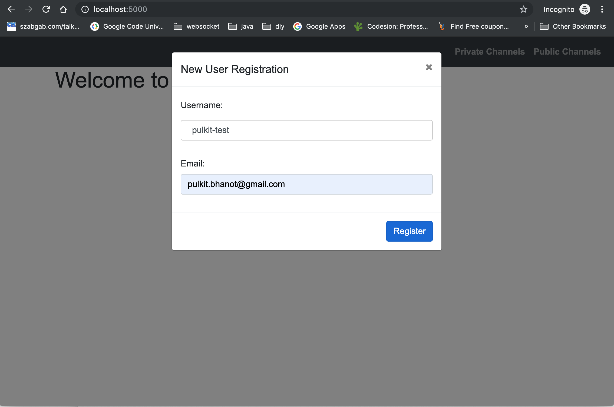
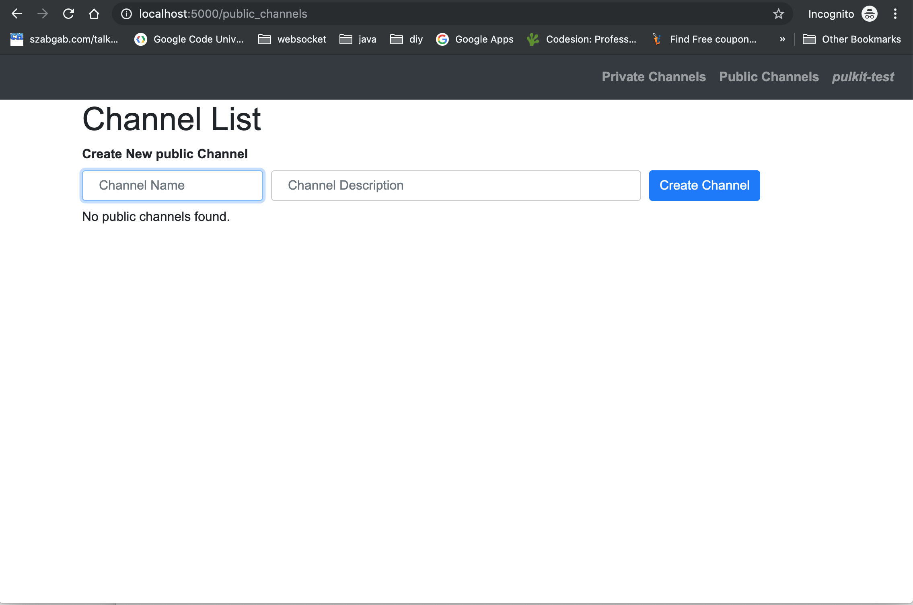
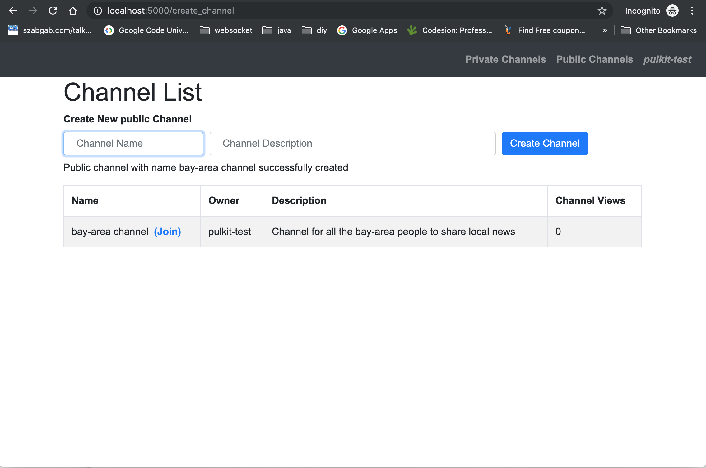
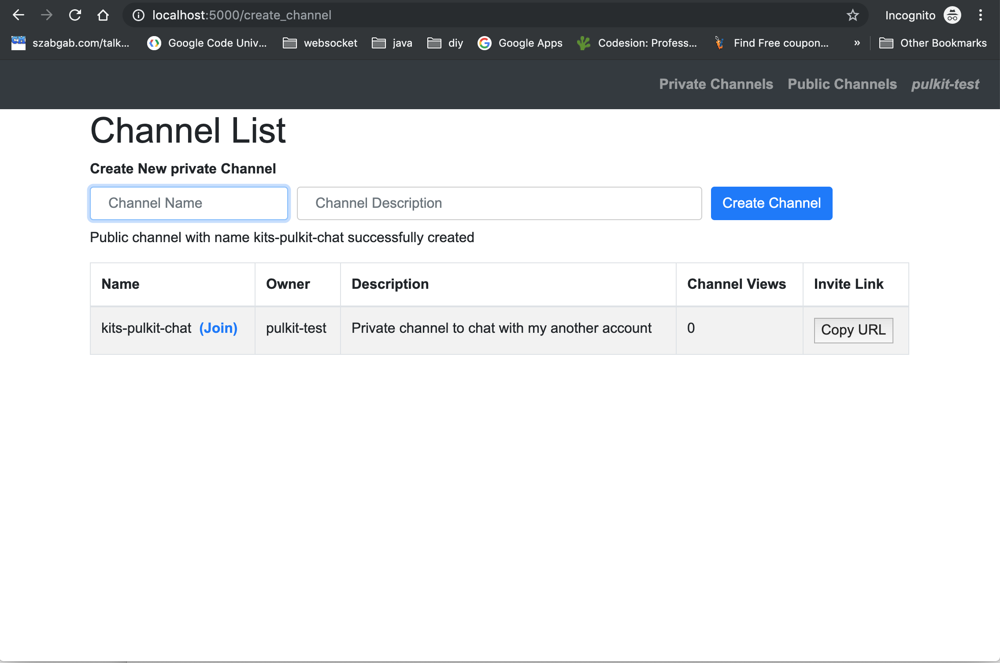
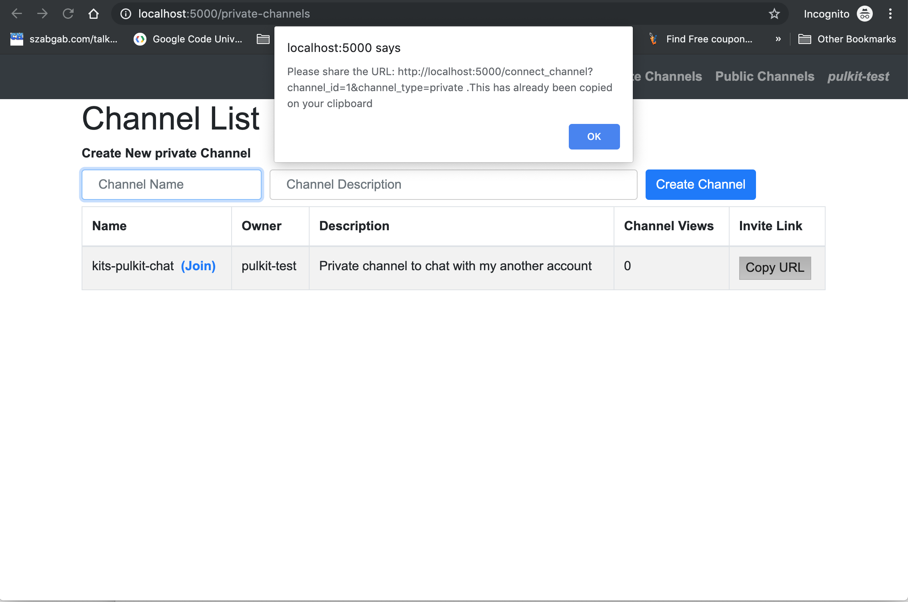
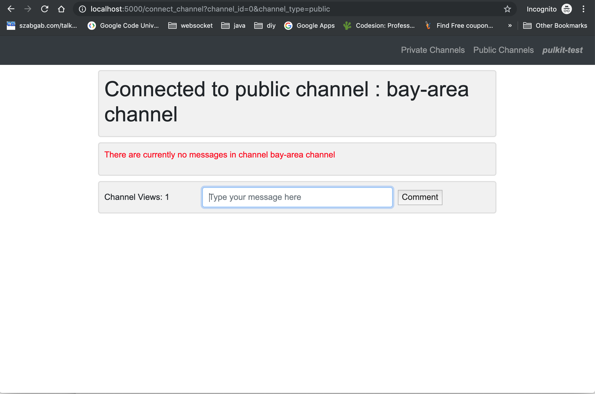
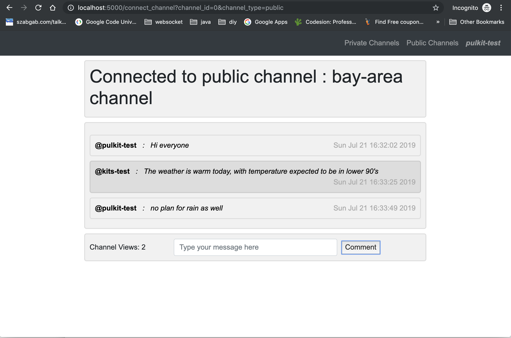

# Project 2

##Web Programming with Python and JavaScript

This project is about developing of a channel based application PeerChat.com, very similar to a chat application. Supported features are
1) User needs to register for logging into the system by specifying only a username and email.

2) If user tries to open any other html pages hosted on the server, it is auto redirected to the registration screen.

3) Post registration user is shown a list of public channels already existing in the system. The screen would look exactly similar for private messages except everywhere where public is displayed will be replaces with private

4) Once a channel is created the new channel is displayed on the same page.

Similar screen for private channels.

Please note that there is an additional 5th column which has a button Copy URL. When a channel owner clicks on this link a dialog is opened with the link to share, the same link is also default copied to user's clipboard to make is easy for sharing.

Any user that has the link can connect to the channel and look at the conversation. No authorization support has been added in the existing implementation. 

5) Channel names are namespaced at global and user account level(for private channel), validation checks for same namespace happen keeping the namespaces in context.

6) For implementing the chat functionality, Flask-socketio concept of rooms is used. When a user opens a channel, a socker event join is sent and the user is added to the selective room for sending/recieving the messages of a selective group.

When there are users conversing in a channel, the messages are sent using sockets and no page refresh is explicitly done.

for every channel last 100 messages are kept in a circular queue. By default when a user opens a channel, the past messages are shown to the user sorted based on the time the messages were recieved on the server side, with most recent message displayed at the bottom just before the comment textbox.

7) As a personal touch to the website, support has been added for private channels, another one is a global counter on the number of views(join) in a channel on the channel chat page which is refreshed using messages over websockets and on the technical side use of rooms to filter out messages on the server side instead of sending all the messages to the client side and filtering them on the client side.

## Implementation details

### javscrpipt files

1) channel.js contains the javascript functions to open a socket, send and recieve different messages.
2) default.js contains a javascript function that is called when copy url function is called for private groups, it also copies the url to the clipboard automatically.

### html files

1) index.html is the default landing page for the project2, if there is no user session currently active it shows a dialog box for the user to enter username and email
2) layout.html is the template for all the non chat screens in the UI, primary difference being that it doesnot open a socket connection to the server.
3) layout_chat.html is the template for all only the chat screen in the UI, it opens a socket connection to the server.
4) channels.html is the landing page post user registration or if a session is already active, this page is used to show both the public and private channels.
5) chat_channels.html this page is explicitly used to show the chat page for a specific channel

### python files
 
1) application.py is the a python file which has all the url wiring for the flask application. Channel id is unique across private/public channels. It also maintains 3 inmemory dictionaries.

    a) Dictionary of global channels in the system.
    
    b) Dictionary of user specific private channels in the system.
    
    c) Dictionary with a papping of channel id to channel.
2) circular_queue.py This is a python file that contains a class CircularQueue for a bounded 100 message queue per channel. This has been taken from github https://gist.github.com/computinginschools/ac50bc81a43b7302cefda4132062eb5a and modified to add support for returning a list of messages in the queue in the timebased insertion order.
3) channel.py This is a python file that contains a class Channel to model a channel object, it stores the details like id, owner, description, a reference to a circular queue with 100 messages and total number of join requests for the channel
4) chat_message.py This is a python file that container a class Message to model a message in the application, it has the required details like sender username, channel id, time of message recieved on the server and message contents.

